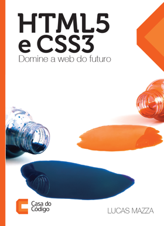

# Exemplos do livro HTML5 e CSS3: Domine a web do futuro

Este é o repositório dos exemplos desenvolvidos no livro
[HTML5 e CSS3: Domine a web do futuro](http://casadocodigo.com.br/products/livro-html-css).
Você pode conferir todos os exemplos em lucasmazza.github.io/htmlcss-exemplos.

O livro é distribuído pela editora [Casa do Código](http://www.casadocodigo.com.br),
com outros títulos sobre programação e startups.

## Licença

Copyright (c) 2012-2014 Lucas Mazza. Veja o arquivo `LICENSE`.
